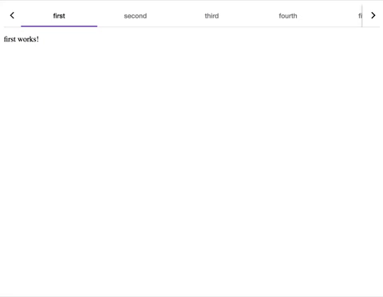

[](https://nodei.co/npm/mat-nav-bar-pagination/)

# MatNavBarPagination

Module for mat-tab-nav-bar that adds the ability to scroll through the list of bookmarks.
You can use the router-outlet and have all tabs in a scrollable panel.



## Installation

To install this library, run:

```bash
$ npm install mat-nav-bar-pagination
```

or yarn:

```bash
$ yarn add mat-nav-bar-pagination
```

## How to use

Add import module to your application:
e.g. in `app.module.ts`

```ts
import { BrowserModule } from "@angular/platform-browser";
import { NgModule } from "@angular/core";
import { AppComponent } from "./app.component";
import { MatTabsModule } from "@angular/material";
import { MatNavBarPaginationModule } from "mat-nav-bar-pagination";

@NgModule({
  declarations: [AppComponent],
  imports: [BrowserModule, MatTabsModule, MatNavBarPaginationModule],
  providers: [],
  bootstrap: [AppComponent]
})
export class AppModule {}
```

For the correct work with `matNavBarPagination`, it is necessary to import MatTabsModule from `@angular/material` and import material styles.

e.g. in `styles.scss`:

```scss
@import "../node_modules/@angular/material/theming";
@import "@angular/material/prebuilt-themes/deeppurple-amber.css";
```

Now you can use it into your code:

```html
<mat-nav-bar-pagination>
  <nav mat-tab-nav-bar #matTabNavBar>
    <a
      mat-tab-link
      routerLink="first"
      dynamicHeight
      routerLinkActive
      #rla1="routerLinkActive"
      [active]="rla1.isActive"
      >first</a
    >
    <a
      mat-tab-link
      routerLink="second"
      dynamicHeight
      routerLinkActive
      #rla2="routerLinkActive"
      [active]="rla2.isActive"
      >second</a
    >
    <a
      mat-tab-link
      routerLink="third"
      dynamicHeight
      routerLinkActive
      #rla3="routerLinkActive"
      [active]="rla3.isActive"
      >third</a
    >
    <a
      mat-tab-link
      routerLink="fourth"
      dynamicHeight
      routerLinkActive
      #rla4="routerLinkActive"
      [active]="rla4.isActive"
      >fourth</a
    >
    <a
      mat-tab-link
      routerLink="fifth"
      dynamicHeight
      routerLinkActive
      #rla5="routerLinkActive"
      [active]="rla5.isActive"
      >fifth</a
    >
    <a
      mat-tab-link
      routerLink="sixth"
      dynamicHeight
      routerLinkActive
      #rla6="routerLinkActive"
      [active]="rla6.isActive"
      >sixth</a
    >

    <!-- Simple way with ngFor -->
     <!-- <a
      mat-tab-link
      *ngFor="let link of navLinks"
      [routerLink]="link.link"
      dynamicHeight
      routerLinkActive
      #rla="routerLinkActive"
      [active]="rla.isActive"
    >
      <span style="opacity: 0.6">{{ link.name }}</span>
    </a> -->
  </nav>
</mat-nav-bar-pagination>
<router-outlet></router-outlet>
```

## Demo

The component demo is available in:

- [the github repository](https://github.com/ambus/matNavBarPaginationTest)
- compiled version in `./demo` directory.

The demo version can be run by script:

```bash
$ npm run demo
```

## License

MIT © [Szymon Standarski](mailto:s.standarski@gmail.com)
